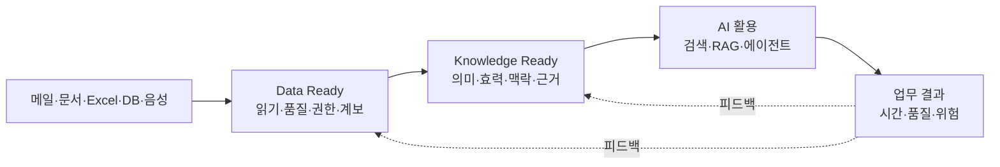

# AI-Ready의 두 축과 원칙

AI-Ready는 데이터 파일의 상태만 뜻하지 않는다. 특정 유즈케이스에 대해 **데이터를
읽고 통제할 수 있는 Data Ready**와 **의미·효력·근거를 믿을 수 있는 Knowledge
Ready**가 함께 준비된 상태다.

::: info 이 프로젝트의 실무 구분
Data Ready와 Knowledge Ready의 두 축은 여러 표준의 공식 성숙도 명칭을 그대로 옮긴
것이 아니라, 레거시 조직이 기술적 데이터 정리와 업무 의미 승인을 혼동하지 않도록
이 위키가 사용하는 운영 모델이다. 각 세부 기준은 연결된 표준·정부 지침·조직 정책으로
검증한다.
:::

  <a class="definition-panel data-panel" href="../data-ready/">
    DATA READY
    <strong>읽을 수 있고 통제할 수 있는가?</strong>
    
원천·접근·파싱·품질·표준·메타데이터·ACL·계보·삭제

  </a>
  <a class="definition-panel knowledge-panel" href="../knowledge-ready/">
    KNOWLEDGE READY
    <strong>의미와 효력을 믿을 수 있는가?</strong>
    
용어·SSoT·시점·범위·맥락·관계·업무 규칙·근거·승인

  </a>

파일 형식을 바꾸거나 벡터DB에 복사했다고 준비가 끝난 것이 아니다. 데이터 품질은
**의도한 목적에 적합한지**를 기준으로 보고, 지식 품질은 **그 의미와 권위 및 적용
조건을 사람이 검증할 수 있는지**를 기준으로 본다. 데이터 품질의 생애주기 관점은
[ISO/IEC 5259-1:2024](https://www.iso.org/standard/81088.html)과도 맞닿아 있다.

::: tip 한 문장 원칙
모든 데이터를 정리하지 말고, 가치 있는 유즈케이스 하나에 필요한 데이터와 지식을
안전하고 검증 가능하게 만드는 것부터 시작한다.
:::

## Data와 Knowledge의 경계를 구분한다

| 상황 | Data Ready 질문 | Knowledge Ready 질문 |
| --- | --- | --- |
| PDF 절차서 | 본문·표·페이지를 손실 없이 읽었는가 | 현재 유효하며 어느 설비에 적용되는가 |
| Excel 장부 | 수식·단위·코드·기준일을 보존했는가 | 이 수치가 확정 실적인가 임시 집계인가 |
| 이메일 | 스레드·첨부·송수신자·ACL을 보존했는가 | 무엇이 제안이고 누가 최종 결정했는가 |
| 회의 음성 | 화자·시각·신뢰도와 원음을 연결했는가 | 어떤 결정이 언제부터 효력이 있는가 |
| 중복 문서 | 동일·유사·버전 후보를 찾았는가 | 어느 원천이 어떤 질문의 SSoT인가 |

Data Ready는 기계가 안전하게 다룰 **재료**를 준비하고, Knowledge Ready는 그 재료에서
사람과 AI가 같은 의미와 근거를 사용할 **판단 체계**를 준비한다. 지식은 데이터와
분리된 새 사일로가 아니라 데이터에 의미·맥락·효력·책임을 더한 관리 계층이다.

## 다섯 가지 위험한 지름길

| 지름길 | 대신 할 일 |
| --- | --- |
| 전사 파일을 전부 수집 | 승인된 유즈케이스 원천만 수집 |
| AI가 SSoT·업무 규칙을 자동 확정 | AI는 후보를 찾고 업무 소유자가 효력 승인 |
| Markdown 변환으로 종료 | 원본·파생물 연결과 변환 품질 검사 |
| RAG가 환각을 해결한다고 기대 | 인용·거절·ACL·삭제 전파 평가 |
| 온프레미스면 안전하다고 판단 | 데이터 흐름과 신뢰경계 기준으로 통제 |

[NIST AI RMF](https://www.nist.gov/itl/ai-risk-management-framework)는 AI 위험관리를
Govern, Map, Measure, Manage의 지속적인 활동으로 제시한다. 따라서 AI-Ready는
한 번의 정제 작업이 아니라 **소유하고, 측정하고, 갱신하는 운영체계**다.

## 첫 유즈케이스의 완료 기준

### Data Ready

- [ ] 원천, 소유자, 정보등급, 권한과 삭제 규칙이 있다.
- [ ] 파일·메일·표·음성의 구조 손실과 추출 오류를 검사한다.
- [ ] 원본과 파생물을 ID·해시·버전·계보로 연결한다.
- [ ] 원문 변경·권한 회수·삭제가 색인과 캐시에 전파된다.

### Knowledge Ready

- [ ] 업무 질문과 답하면 안 되는 질문이 정의됐다.
- [ ] 핵심 용어·단위·코드와 동의어가 합의됐다.
- [ ] SSoT·효력·범위·충돌을 업무 소유자가 판정한다.
- [ ] 사실·규칙·결정에서 정확한 원문 위치와 버전을 확인할 수 있다.
- [ ] 정답·부분정답·명확화·거절·권한 차단을 골든셋으로 평가한다.

### AI 활용·운영

- [ ] 두 준비 게이트를 통과한 범위만 서비스에 게시한다.
- [ ] 오류를 Data·Knowledge·검색·모델·정책 원인으로 구분한다.
- [ ] 품질·효과·위험을 고칠 담당자와 운영 주기가 있다.

<a class="md-button md-button--primary" href="../">30분 Quick Start로 돌아가기</a>
