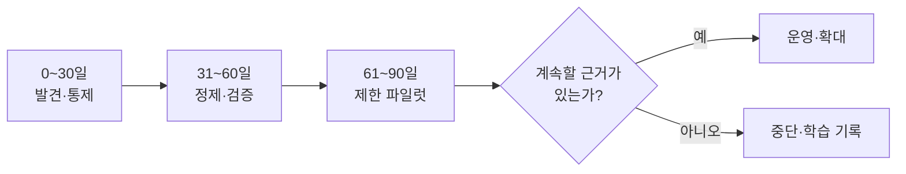

# 첫 유즈케이스를 위한 90일 로드맵

90일의 목적은 전사 데이터 플랫폼 완성이 아니다. 유즈케이스 하나에 대해 **안전하게
근거를 수집하고, 사람이 검증할 수 있는 답을 제공하며, 실패를 측정하는 작은 운영
루프**를 만드는 것이다. [NIST AI RMF Core](https://airc.nist.gov/airmf-resources/airmf/5-sec-core/)의
Govern·Map·Measure·Manage 활동을 세 단계 전체에 반복한다.

## 시작 전: 작은 질문을 고른다

첫 유즈케이스는 다음을 모두 만족해야 한다.

- 주 1회 이상 반복되고 탐색·요약에 시간이 많이 든다.
- 틀렸을 때 사람이 확인하고 되돌릴 수 있다.
- 필요한 원천의 경계와 소유자를 2주 안에 찾을 수 있다.
- 사용자 5~20명과 실제 질문 30개 이상을 확보할 수 있다.
- 효과를 시간, 검색 성공률, 재작업, 준수율 중 하나로 측정할 수 있다.

인사 평가, 자동 승인, 안전 설비 제어처럼 오류가 사람의 권리·안전에 직접 영향을
주는 의사결정은 첫 유즈케이스로 선택하지 않는다.

## 0~30일: 발견하고 멈출 곳을 정한다

### 해야 할 일

1. 사용자·업무 순간·결정을 한 문장으로 잠근다.
2. 실제 질문 30개와 “답하면 안 되는 질문” 10개를 수집한다.
3. 원천·소유자·시스템·등급·ACL·보존·형식·규모를 목록화한다.
4. 대표, 낡음, 중복, 충돌, 암호화, 스캔 문서를 포함해 샘플링한다.
5. 데이터 흐름과 외부 통신을 그려 보안·개인정보 검토를 받는다.
6. [경영효과 측정](business-impact.md)에 따라 현재 업무의 시간·오류·재작업 기준선과
   비교 집단을 정한다.

### 30일 게이트 산출물

- 승인된 [유즈케이스 캔버스](../templates/use-case-canvas.md)
- [데이터 원천 인벤토리](../templates/source-inventory.md)와 접근 승인
- [정보등급·권한표](../templates/access-matrix.md)
- 기준 질문, 금지 질문, 현재 성능 기준선
- 현금·생산 여력·품질·위험으로 분리한 효과 측정 카드
- 중단 조건과 다음 단계 승인자

## 31~60일: 대표 데이터를 정제하고 정답을 만든다

### 해야 할 일

1. 원본을 변경 불가능한 영역에 보존하고 원본 ID·해시를 부여한다.
2. 파일 유형별로 텍스트·표·이미지 설명·메타데이터를 추출한다.
3. 중복·버전·상충 규정을 적용하고 SSoT 후보를 사람이 판정한다.
4. 용어·단위·코드와 문서 구조를 최소 범위에서 표준화한다.
5. 질문별 정답, 허용 원천, 필수 인용, 거절 조건을 골든셋으로 만든다.
6. 파서·검색·권한·삭제 동작을 각각 독립적으로 시험한다.

### 60일 게이트 산출물

- 원본-파생물 계보와 변환 실패 보고서
- 승인된 [SSoT·충돌대장](../templates/ssot-register.md)
- 최소 용어사전과 품질 규칙
- 50개 이상의 [RAG 골든셋](../templates/rag-golden-set.md)
- 파일럿 허용 사용자·원천·기능·기간

::: tip 왜 50문항인가
통계적 완벽함을 뜻하지 않는다. 정상 질문만 데모하는 일을 막고, 실제 질문·모호한
질문·무근거 질문·권한 차단·오염 문서를 의도적으로 포함하기 위한 시작점이다.
:::

## 61~90일: 제한된 사용자로 운영을 연습한다

### 해야 할 일

1. 읽기 전용, 제한 사용자, 제한 원천으로 배포한다.
2. 모든 답에 원문·버전·섹션을 표시하고 근거 없으면 거절한다.
3. 골든셋과 실제 피드백으로 검색·인용·답변·권한을 주 단위 평가한다.
4. 원본 갱신, ACL 회수, 삭제, 오염 문서 격리 훈련을 수행한다.
5. 오류의 원인을 콘텐츠·파싱·검색·모델·권한·UX로 분류한다.
6. 기준선·비교 집단 대비 효과와 낮음·기준·높음 ROI를 계산한다.
7. 90일 의사결정 회의에서 확대, 보완, 중단 중 하나를 고른다.

### 90일 완료 기준

- [ ] 사용자에게 유용한 대표 질문의 목표 성공률을 달성했다.
- [ ] 모든 답에서 인용을 열어 원문과 버전을 검증할 수 있다.
- [ ] 권한 없는 문서·청크·캐시가 노출되지 않는다.
- [ ] 근거가 없거나 충돌하면 자신 있게 답하지 않고 거절한다.
- [ ] 변경·권한 회수·삭제가 합의한 시간 안에 전파된다.
- [ ] 품질 SLO, 운영자, 데이터 소유자, 보안 대응자가 지정됐다.
- [ ] 기준선 대비 시간·재작업·검색 성공률 중 하나가 개선됐다.

## 역할의 기본값

| 역할 | 책임 | 대리할 수 없는 결정 |
| --- | --- | --- |
| 현업 소유자 | 유즈케이스·정답·SSoT·효력 승인 | 무엇이 업무상 유효한가 |
| 데이터 스튜어드 | 인벤토리·용어·품질·변경관리 | 품질 예외의 수용 여부 |
| IT/플랫폼 | 수집·저장·색인·계보·복구 | 운영 가능성과 장애 대응 |
| 보안·개인정보 | 등급·처리근거·ACL·감사 | 수집·접근·반출 허용 여부 |
| AI 담당 | 검색·프롬프트·평가·관측 | 모델 릴리스와 평가 통과 |
| 사용자 대표 | 실제 질문·피드백·업무 검증 | 실제 업무에 쓸 수 있는가 |

[90일 백로그·RACI 템플릿](../templates/roadmap-raci.md)에 실제 이름과 승인일을
기록한다. “AI팀”처럼 집단만 적지 않는다.

## 확대 또는 중단 결정

확대는 GPU 사용률이나 데모 반응이 아니라 다음 근거로 정한다.

- 업무 효과가 기준선보다 좋아졌는가?
- 위험과 잔여 오류를 사용자·소유자가 이해하는가?
- 새 원천을 추가해도 권한·계보·평가가 반복 가능한가?
- 운영비와 사람의 검토 비용을 포함해 지속 가능한가?

목표를 달성하지 못했다면 실패 원인을 기록하고 중단할 수 있다. 목적 없는 전사 확장보다
근거 있는 중단이 더 성숙한 결정이다.
