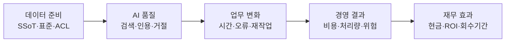

# AI-Ready Data 경영효과 측정

모델 정확도가 아니라 **업무 결과가 기준선보다 얼마나 좋아졌는지**를 측정한다.

<div class="metric-grid">
  <div class="metric-card"><strong>💵 현금 효과</strong>실제로 사라진 계약·외주·초과근무·재처리 비용</div>
  <div class="metric-card"><strong>⏱️ 생산 여력</strong>절약한 시간을 더 가치 있는 업무에 재배치한 효과</div>
  <div class="metric-card"><strong>✅ 서비스·품질</strong>처리시간, 최초 성공률, 오류, 재작업, 사용자 결과</div>
  <div class="metric-card"><strong>🛡️ 위험 감소</strong>권한 누출, 규정 위반, 장애와 잘못된 결정의 기대손실 감소</div>
</div>

!!! warning "시간 절감은 곧바로 비용 절감이 아니다"
    1,000시간을 절약해도 예산·인원·외주비가 줄지 않았다면 **현금 절감**이 아니라
    **생산 여력**이다. 추가 처리량이나 품질 개선으로 재배치된 증거를 함께 남긴다.

## 효과가 만들어지는 연결고리



각 화살표를 별도로 검증한다. 검색 정확도가 올라도 사용자가 쓰지 않으면 업무 효과는
0이고, 시간이 줄어도 재배치하지 않으면 현금 효과는 0이다. NIST AI RMF도 AI 위험과
영향을 정량·정성 또는 혼합 방법으로 측정하고, 불확실성과 기준 비교를 함께 보고하는
방식을 제시한다([NIST AI RMF Core](https://airc.nist.gov/airmf-resources/airmf/5-sec-core/)).

## 1. 효과 지표를 하나씩 연결한다

| 원천 문제 | AI-Ready 지표 | 업무 지표 | 경영 지표 |
| --- | --- | --- | --- |
| 최종본을 모름 | 승인 SSoT 비율 | 잘못된 버전 사용률 | 재작업 비용 |
| 메일 검색이 느림 | 출처 포함 검색 성공률 | 건당 탐색시간 | 생산 여력·처리량 |
| 표·스캔 추출 실패 | 필드 정확도·변환 성공률 | 수기 보정시간 | 외주·처리 비용 |
| 용어·단위 불일치 | 표준 매핑률 | 오류·반려율 | 재처리·지연 비용 |
| ACL이 색인에 미반영 | 권한 테스트 통과율 | 누출·차단 건수 | 기대손실·감사 위험 |
| 근거 없는 RAG 답변 | 인용 적합성·거절률 | 최초 해결률 | 처리량·서비스 수준 |

지표마다 **정의, 단위, 데이터 원천, 기준선 기간, 목표, 소유자, 중단 기준**을 기록한다.
평균만 쓰지 말고 중앙값과 90번째 백분위수를 함께 보면 일부 사용자의 긴 지연을 숨기지
않는다.

## 2. 기준선과 반사실을 만든다

도입 전 2~4주간 같은 사용자·같은 유형의 업무를 측정한다. 가능하면 도입하지 않은
비교 집단을 남긴다. 2026년
[Magenta Book](https://www.gov.uk/government/publications/the-magenta-book/magenta-book-central-government-guidance-on-evaluation-html)은
개입이 없었을 때의 결과인 **반사실**과 비교해야 관찰된 변화의 귀속을 판단할 수 있다고
설명한다.

| 상황 | 권장 설계 | 근거 등급 |
| --- | --- | --- |
| 사용자·업무를 무작위 배정 가능 | 동일 과제 A/B 또는 무작위 대조시험 | A |
| 팀별로 순차 도입 가능 | 단계 도입 + 차이의 차이(DiD) | B |
| 대조군 없이 로그만 있음 | 중단 시계열 또는 반복 전후 비교 | C |
| 기준선도 없어 인터뷰만 가능 | 전문가 추정 후 30일 안에 실측 | D |

```text
단순 전후 효과 = 도입 후 지표 - 도입 전 지표

차이의 차이 = (도입팀_도입후 - 도입팀_도입전)
             - (비교팀_도입후 - 비교팀_도입전)
```

전사 동시 배포는 대조군을 없앤다. 먼저 2~4개 팀에 순차 도입하면 운영 위험을 낮추면서
효과도 더 정확하게 측정할 수 있다. 표본이 작다면 퍼센트 하나를 확정값처럼 말하지 말고
표본 수, 범위와 신뢰구간을 함께 보고한다.

## 3. 돈으로 바꾸는 다섯 계산식

### 생산 여력

```text
연간 절약시간 = (기준시간 - 도입후시간) × 연간대상건수 × 실제도입률
생산여력 가치 = 연간 절약시간 × 시간당 총인건비
```

총인건비에는 조직이 합의한 급여·복리후생·간접비 기준을 사용한다. 도입률은 라이선스
수가 아니라 실제 업무 로그에서 구한다. 영국 정부의
[Digital and Data Benefits Framework](https://www.gov.uk/government/publications/digital-and-data-benefits-framework/digital-and-data-benefits-framework)는
데이터 접근 개선의 시간 절감과 AI 생산성을 역할, 과업시간, 영향 인원과 임금 자료로
추정하되 기준선 운영비용을 먼저 만들도록 제안한다.

### 오류·재작업 회피

```text
회피비용 = (도입전 오류건수 - 도입후 오류건수) × 오류 1건당 재처리 원가
```

오류 원가에는 실제 추가 작업시간, 외주·배송·폐기 등 증분 비용만 넣는다. 같은 절약시간을
생산 여력과 재처리 회피 양쪽에 중복 계상하지 않는다.

### 현금 절감

```text
현금절감 = 실제 감액된 계약·라이선스·외주·초과근무·인프라 비용
```

예산에서 확인되지 않은 “절감 가능액”은 현금 효과로 표시하지 않는다.

### 위험회피액

```text
연간 기대손실 = 사고확률 × 사고 1건당 영향액
위험회피액 = 도입전 기대손실 - 도입후 기대손실
```

희귀 사고는 확률 하나를 정밀한 숫자처럼 제시하기 어렵다. 낮음·기준·높음 시나리오와
비재무 영향, 보안 중단 조건을 함께 보고한다.

### ROI와 회수기간

```text
ROI = (검증된 총편익 - 총비용) ÷ 총비용 × 100
회수기간(개월) = 초기투자 ÷ 월 순편익
```

총비용에는 문서 정리, 소유자 검토, OCR·파싱, 온프레미스 장비, 라이선스, 보안 검토,
평가셋, 교육, 사람 검수, 운영·재색인·백업과 폐기 비용을 포함한다. 1년을 넘는 투자라면
조직의 공식 할인율로 비용과 편익의 현재가치를 계산한다.

## 4. 숫자 하나 대신 범위를 보고한다

최소한 **낮음·기준·높음** 세 시나리오에서 다음 변수를 바꾼다.

- 실제 도입률
- 건당 절약시간
- 연간 업무량
- 오류 감소율
- 단위 인건비와 운영비

[Green Book 2026](https://www.gov.uk/government/publications/the-green-book-appraisal-and-evaluation-in-central-government/the-green-book-2026)은
개입 없이도 생겼을 변화와 추가 효과를 구분하고 비용·편익·기간의 낙관편향을 조정하도록
한다. 조정률은 임의로 정하지 말고 과거 유사 사업의 예측 대비 실적 오차를 사용한다.
GAO도 단일 점 추정보다 주요 가정을 바꾼 범위와 민감도 분석이 의사결정에 유용하다고
권고한다([GAO Cost Estimating and Assessment Guide](https://www.gao.gov/products/gao-20-195g)).

## 계산 예시 — 승인 문서 검색

다음은 실제 기업이 아닌 **합성 예시**다.

| 항목 | 실측·가정 |
| --- | ---: |
| 연간 검색 | 12,000건 |
| 건당 중앙값 | 18분 → 8분 |
| 실제 도입률 | 65% |
| 시간당 총인건비 | 55,000원 |
| 잘못된 버전 재작업 | 연 96건 → 48건 |
| 재작업 1건 증분 원가 | 180,000원 |
| 초기 구축 / 연 운영비 | 3,000만원 / 3,600만원 |

```text
생산 여력 = (10분 ÷ 60) × 12,000건 × 65% × 55,000원 = 7,150만원
재작업 회피 = (96건 - 48건) × 180,000원 = 864만원
1년차 경제적 ROI = (8,014만원 - 6,600만원) ÷ 6,600만원 = 21.4%
```

하지만 실제 예산 감소는 재작업비 864만원뿐이라면 **현금 기준 ROI는 음수**다.
경영진 보고에는 경제적 ROI와 현금 ROI를 분리하고, 1,300시간이 어떤 추가 산출물로
재배치됐는지 다음 분기에 검증한다.

## 90일 측정 순서

| 기간 | 측정 작업 | 의사결정 증거 |
| --- | --- | --- |
| 0~30일 | 효과 소유자, 기준선, 비용, 대조군 확정 | 측정 카드와 원본 로그 |
| 31~60일 | 파서·검색·권한 품질과 과업시간 실험 | A/B 결과와 실패 유형 |
| 61~90일 | 실제 도입률, 업무 결과, 운영비 측정 | 낮음·기준·높음 ROI |
| 90일 | 확대·보완·중단 결정 | 효과·위험·잔여 가정 |

[경영효과 측정 CSV 내려받기](../assets/downloads/business-impact.csv){ .md-button .md-button--primary }

## 경영진에게 보여줄 한 장

1. 해결할 업무 질문과 대상 사용자
2. 기준선과 비교 집단
3. AI 품질 게이트와 업무 지표
4. 현금·생산 여력·품질·위험 효과의 분리
5. 초기·반복·숨은 운영비용
6. 낮음·기준·높음 ROI와 가장 민감한 가정
7. 확대·보완·중단 결정과 다음 측정일

외부 성공사례의 생산성 수치는 가설을 만드는 참고값일 뿐 우리 조직의 편익이 아니다.
우리 기준선, 실제 사용 로그와 비교 결과로 다시 증명한다.

해외 정부 평가 지침은 국내 조직의 직접 준수 규정이 아니라 측정 설계를 위한 참고자료다.
공공기관은 기관별 예비타당성·성과관리 지침과 할인율을 우선 적용한다.

인과평가·데이터 가치평가·공개 생산성 연구의 적용 범위와 한계는
[경영효과·실증 근거표](../reference/value-evidence.md)에서 확인한다.
