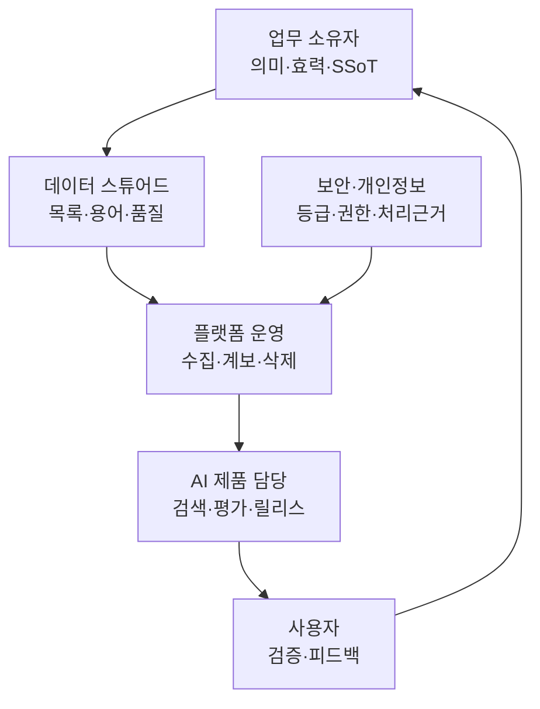

# AI-Ready Data 거버넌스

거버넌스는 위원회 이름이 아니라 **데이터에 관한 결정을 누가, 어떤 증거로, 언제까지
내리는지** 정하는 운영 규칙이다. NIST AI RMF는 거버넌스를 나머지 위험관리 활동에
스며드는 교차 기능으로 두며, 정책·역할·책임·문서화와 제3자 데이터 위험까지 다룬다.
([NIST AI RMF Core](https://airc.nist.gov/airmf-resources/airmf/5-sec-core/))

## 최소 운영 모델

한 사람이 여러 역할을 맡아도 괜찮지만 승인권과 실행권은 구분한다. AI 담당자가
자신이 만든 검색 결과를 업무상 SSoT로 승인해서는 안 된다.

## 데이터 제품 카드

AI에 제공되는 원천 묶음마다 다음 한 장을 유지한다.

| 필드 | 답해야 할 내용 |
| --- | --- |
| 이름과 목적 | 어느 유즈케이스의 어떤 질문을 지원하는가 |
| 업무 소유자·스튜어드 | 의미·효력·품질·예외를 결정할 실명 담당자 |
| 원천과 범위 | 시스템, 폴더, 테이블, 메일함, 제외 범위 |
| 정보등급·법적 근거 | 개인정보, 기밀, 규제정보, 처리 목적과 보존 근거 |
| 품질 규칙·SLO | 정확성, 최신성, 완전성, 중복, 추출 성공률 |
| 버전·효력 | 시행일, 폐기일, 현재 유효한 버전 판정 규칙 |
| 소비자·ACL | 누가 어떤 조건에서 원문과 파생물을 읽는가 |
| 변경·삭제 | 증분 주기, 권한 회수, 보존 만료, 파생물 삭제 방식 |
| 평가·모니터링 | 골든셋, 사용자 피드백, 오류·사고 지표 |

## 네 개의 의사결정 기록

### 1. 출처 등록

새 폴더나 메일함을 연결하기 전에 목적, 소유자, 등급, ACL, 보존, 예상 형식과 규모를
[데이터 원천 인벤토리](../templates/source-inventory.md)에 등록한다.

### 2. SSoT와 충돌 판정

문서 제목이나 수정일만으로 최신본을 정하지 않는다. 승인 상태, 효력일, 소유자,
문서 유형별 권위, 폐기 표시를 사용하고 충돌은
[SSoT·충돌대장](../templates/ssot-register.md)에 남긴다.

### 3. 품질 예외

모든 오류를 고칠 수 없다. 어떤 오류를 어느 기간 허용했는지, 영향을 받는 질문과
보완 통제가 무엇인지 [데이터 품질 점수표](../templates/quality-scorecard.md)에 남긴다.

### 4. 변경과 폐기

원본 수정·권한 회수·보존 만료·법적 보존 명령이 생기면 파생 텍스트, 청크, 임베딩,
검색 색인, 답변 캐시, 평가 데이터에 같은 변경이 전파돼야 한다.

## 회의체는 예외를 결정할 때만 연다

| 주기 | 참가자 | 결정할 것 | 가져올 증거 |
| --- | --- | --- | --- |
| 매주 파일럿 | 스튜어드·AI·사용자 대표 | 상위 오류와 수정 우선순위 | 실패 질문, 원문, 원인 분류 |
| 매월 데이터 | 업무 소유자·스튜어드·IT | SSoT 충돌, 품질 예외, 원천 변경 | 충돌대장, 품질 추세, 계보 |
| 분기 위험 | 소유자·보안·법무·플랫폼 | 접근·보존·사고·확대 승인 | 감사로그, 삭제 증거, 위협모델 |

상태 공유는 대시보드로 하고, 회의는 권한·예외·자원처럼 담당자 혼자 결정할 수 없는
안건에 집중한다. 결정은 [의사결정 로그](../templates/decision-log.md)에 남긴다.

## 기록과 보존은 AI 프로젝트 밖의 책임이다

메일·채팅·음성도 업무 결정의 증거가 될 수 있다. 단순 아카이브는 기록 분류, 보존,
법적 보존, 접근, 폐기를 모두 해결하지 않는다. 전자기록의 생애주기 요구사항을 체계화한
[NARA Universal ERM Requirements](https://www.archives.gov/records-mgmt/policy/universalermrequirements)처럼,
AI 색인은 기존 기록관리 정책을 상속해야 한다.

!!! danger "복사본이 새 보존 의무를 만든다"
    원본이 삭제됐는데 벡터 색인과 답변 캐시에 내용이 남으면 정책을 지킨 것이 아니다.
    파생 저장소를 데이터 인벤토리와 삭제 절차에 포함한다.

## 성공 지표

- 소유자 없는 원천 수와 해소 시간
- 기한이 지난 검토·승인·폐기 문서 수
- SSoT 충돌 건수와 평균 판정 시간
- 품질 예외의 만료·재승인 비율
- 원본 변경·ACL 회수·삭제의 파생물 전파 시간
- 출처 없는 답변과 사용자 신고의 처리 시간

거버넌스 문서를 만들었다면 [온프레미스 보안](security.md)에서 실제 데이터 경로와
권한 상속을 확인한다.

