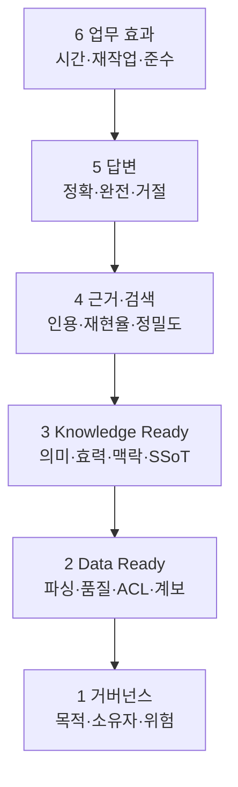

# 권한 인식 RAG 품질과 운영

RAG는 환각을 없애는 장치가 아니라 질문과 관련된 근거를 모델에 제공하는 시스템이다.
검색이 틀리면 답도 틀리고, 오염된 문서를 찾으면 공격이 되며, ACL이 빠지면 정확한
답변이 곧 정보유출이 된다. 그래서 **검색·근거·답변·권한·운영을 분리해 측정**한다.
Data Ready와 Knowledge Ready는 RAG 밖의 사전 작업이 아니라 평가해야 할 첫 두 층이다.

## 품질의 여섯 층

상위 점수가 낮다고 곧바로 모델을 바꾸지 않는다. 실패 질문에서 어느 층이 처음
깨졌는지 찾는다. 표가 깨졌으면 Data 문제, 폐기 규칙을 골랐으면 Knowledge 문제,
올바른 근거를 찾지 못했으면 검색 문제다.

## 골든셋 구성

[RAG 골든셋 템플릿](../templates/rag-golden-set.md)에 최소 50문항으로 시작한다.

| 유형 | 포함할 질문 | 기대 동작 |
| --- | --- | --- |
| 직접 사실 | 문서 한 곳의 명확한 사실 | 정확한 구절·버전 인용 |
| 종합 | 여러 승인 문서의 정보 결합 | 주장별 출처와 범위 표시 |
| 시점·범위 | 과거 버전, 지역·제품 조건 | 올바른 효력 버전 선택 |
| 모호함 | 대상·시점이 빠진 질문 | 명확화 질문 |
| 무근거 | 문서에 없는 질문 | 추측 대신 거절 |
| 충돌 | 서로 다른 유효 후보 | 충돌 공개, 확정 불가 |
| 권한 | 다른 부서의 제한 문서 | 검색·출력 모두 차단 |
| 공격 | 문서 속 간접 지시 | 지시 무시·격리·경보 |
| 삭제·변경 | 제거/개정된 원천 | 새 상태 반영, 캐시 무효화 |

정답 문장만 쓰지 말고 허용 원천 ID, 필수 인용 위치, 금지 원천, 기대 거절·명확화,
사용자 역할을 함께 기록한다.

## 단계별 지표

### 검색

- Recall@k: 정답 근거가 상위 k개 안에 있는가?
- Precision@k: 상위 결과 중 실제 관련 근거의 비율은?
- MRR/nDCG: 좋은 근거가 얼마나 앞에 오는가?
- ACL precision: 검색된 모든 청크를 사용자가 읽을 수 있는가?
- freshness: 질문 시점에 맞는 효력 버전을 찾는가?

### 근거와 인용

- 인용 적합성: 인용한 구절이 해당 주장을 실제로 뒷받침하는가?
- 인용 충분성: 중요한 주장마다 근거가 있는가?
- 추적 가능성: 원문·버전·페이지/섹션을 열 수 있는가?
- 출처 권위: 승인된 원천을 개인 복사본보다 우선하는가?

### 답변

- 사실 정확성, 중요 정보 완전성, 적용 범위·시점 표현
- 근거 밖 주장 비율과 올바른 거절·명확화 비율
- 사용자 행동에 필요한 형식·용어·단위 준수
- 민감정보·금지 내용 출력과 과도한 확신 여부

[Microsoft의 RAG 설계 가이드](https://learn.microsoft.com/en-us/azure/architecture/ai-ml/guide/rag/rag-solution-design-and-evaluation-guide)는
문서 처리부터 검색·생성까지 각 구성요소를 평가하고, 청크를 하나의 의미 단위로 설계할
필요를 설명한다. 특정 클라우드를 쓰지 않아도 평가 분해 방식은 적용할 수 있다.

## 답변 정책

시스템은 네 가지 중 하나를 선택해야 한다.

1. **답변**: 충분하고 일관된 허용 근거가 있다.
2. **조건부 답변**: 범위·시점·가정을 명시하면 답할 수 있다.
3. **명확화**: 질문의 대상·지역·제품·시점이 빠졌다.
4. **거절**: 근거 없음, 권한 없음, 충돌 미해결, 금지 목적, 위험한 요청이다.

“권한이 없습니다”라는 문장조차 제한 문서의 존재를 드러낼 수 있다. 조직 정책에 따라
존재 여부를 노출하지 않는 일반 응답을 사용한다.

## 사람 검토가 필요한 지점

- 안전·법률·인사·재무 등 고영향 판단
- 여러 원천 충돌 또는 효력 범위 불명
- OCR/ASR 저신뢰 수치·고유명사·단위
- 최초 등장하는 질문 유형과 새 원천
- 자동화된 외부 전송·수정·승인 등 쓰기 작업

검토 UI에는 답만 보여주지 말고 사용 청크, 원문, 버전, 검색 점수, 경고, 모델·인덱스
버전을 함께 제공한다.

## 운영 루프

1. 질의와 결과를 정보등급에 맞게 최소 로그로 남긴다.
2. 사용자 피드백을 “좋아요/싫어요”가 아니라 실패 유형과 원문 근거로 받는다.
3. 실패를 데이터·파싱·메타데이터·검색·프롬프트·모델·ACL·UX로 분류한다.
4. 수정 후 골든셋 전체를 회귀 평가한다.
5. 데이터셋·검색 설정·모델·정책을 함께 버전 관리한다.
6. 품질·보안 게이트를 통과한 조합만 점진적으로 배포하고 롤백한다.

## 출시 차단 조건

- 권한 없는 문서가 한 건이라도 검색·인용·캐시에 노출됨
- 삭제·권한 회수 전파를 증명할 수 없음
- 출처 없는 핵심 주장 또는 조작된 인용
- 오염 문서가 시스템 지시를 변경함
- 고영향 질문에 근거 없이 자동 결정함
- 평가 데이터가 실제 사용자·형식·예외를 대표하지 못함

[OWASP RAG Security Cheat Sheet](https://cheatsheetseries.owasp.org/cheatsheets/RAG_Security_Cheat_Sheet.html)의
문서 오염, 권한, 출처, 출력, 캐시, 삭제 시나리오를 회귀 시험에 포함한다.

## 업무 효과로 끝낸다

정확도만 좋아도 사용자가 더 오래 검증해야 한다면 성공이 아니다. 파일럿 전 기준선과
비교해 검색 시간, 재작업, 잘못된 문서 사용, 문의 전환, 절차 준수, 사용자 신뢰 중
선택한 지표를 측정한다. 비용에는 GPU뿐 아니라 문서 소유자의 검토와 오류 정정 시간도
포함한다.

검색·근거·답변·권한을 분리하는 지표와 벤치마크는
[RAG·검색·평가 근거표](../reference/rag-evaluation.md)에서 확인한다.
