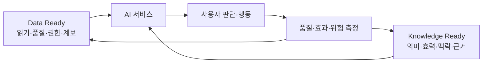

# AI 활용·운영 — 두 준비축을 안전한 서비스로

AI 활용은 세 번째 데이터 정리 단계가 아니다. **Data Ready와 Knowledge Ready를 모두
통과한 범위만** 검색·RAG·에이전트에 제공하고 업무 효과와 위험을 계속 측정하는 단계다.
[NIST AI RMF Core](https://airc.nist.gov/airmf-resources/airmf/5-sec-core/)의
Govern·Map·Measure·Manage도 출시 전 점검이 아니라 운영 전체에 반복한다.

## 두 입력이 모두 필요한 이유

| 상태 | 결과 |
| --- | --- |
| Data Ready만 됨 | 텍스트는 잘 찾지만 낡은 규칙·잘못된 약어·미승인 결정을 답할 수 있음 |
| Knowledge Ready만 됨 | 의미는 합의했지만 원문 파싱·권한·변경·삭제가 불안정해 서비스할 수 없음 |
| 둘 다 안 됨 | 데모는 가능해도 정확도·보안·운영 비용을 설명할 수 없음 |
| 둘 다 됨 | 허용된 최신 근거를 찾고 상태·범위·출처를 보여주며 모르면 거절 가능 |

## 운영 시작 순서

1. [준비도 진단](../01-assess/readiness.md)에서 두 게이트의 가장 낮은 축을 찾는다.
2. 질문별로 승인된 원천과 지식 단위만 서비스 데이터셋에 게시한다.
3. 문서 구조와 질문에 맞춰 청킹하고 키워드·벡터·필터 검색을 비교한다.
4. 모든 주장에 원문·버전·섹션을 표시하고 충돌·무근거·무권한은 거절한다.
5. [RAG 품질과 운영](../05-pipeline/rag-operations.md)의 골든셋으로 계층별 실패를 찾는다.
6. [경영효과 측정](../01-assess/business-impact.md)에서 기준선·채택률·비용·위험을 함께 본다.

## AI 운영 게이트

- [ ] 질문별로 Data Ready와 Knowledge Ready 통과 증거가 있다.
- [ ] 검색 전 ACL 필터와 응답 전 재검증을 적용한다.
- [ ] 답변·조건부 답변·명확화·거절 정책이 있다.
- [ ] 정답뿐 아니라 충돌·무근거·권한·삭제·공격 질문을 시험한다.
- [ ] 원본 변경이 지식·청크·색인·캐시·평가셋에 전파된다.
- [ ] 실패를 데이터·지식·검색·모델·정책·UX 원인으로 구분한다.
- [ ] 기준선 대비 업무 효과와 사람 검토를 포함한 총비용을 측정한다.

::: warning 모델 교체보다 먼저 볼 것
답이 틀렸다면 먼저 원문 손실(Data), 의미·효력 오류(Knowledge), 검색 실패, 답변 생성
중 어디서 처음 깨졌는지 찾는다. 원인을 모른 채 모델만 바꾸면 오류가 이동한다.
:::

첫 실행은 [90일 로드맵](../01-assess/90-day-roadmap.md)으로 제한하고, 운영 구조는
[참조 아키텍처](../reference/architectures.md)에서 규모별로 비교한다.
