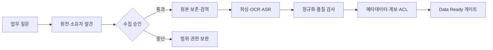

# Data Ready — 데이터를 읽고 통제할 수 있게

Data Ready는 파일을 한곳에 모으거나 형식을 바꾸는 일이 아니다. 선택한 유즈케이스에
필요한 원천을 **찾고, 허가받고, 손실 없이 읽고, 품질을 확인하고, 변경·권한·삭제를
추적할 수 있는 상태**로 만드는 일이다.

::: tip 완료를 판단하는 한 문장
같은 원천을 다시 처리해도 누가 어떤 버전을 어떤 권한으로 변환했는지 설명하고 결과를
재현할 수 있다.
:::

<figure class="guide-illustration">
  
  <figcaption>Data Ready는 변환 한 번이 아니라 원천에서 구조화 데이터까지 품질·권한·계보를 잇는 운영 상태다.</figcaption>
</figure>

## 네 가지 준비축

  

    01 · SOURCE
    <strong>원천과 접근</strong>
    
위치·소유자·목적·정보등급·ACL·보존과 수집 승인을 안다.

  

  

    02 · MACHINE READABLE
    <strong>기계 판독</strong>
    
메일·문서·표·스캔·음성을 구조와 좌표를 보존하며 추출한다.

  

  

    03 · QUALITY
    <strong>품질과 표준</strong>
    
형식·단위·코드·결측·중복·추출 오류를 규칙과 표본으로 검사한다.

  

  

    04 · CONTROL
    <strong>보호와 계보</strong>
    
원본 ID·해시·버전·ACL·변환 이력·보존·삭제 상태를 파생물까지 잇는다.

  

AI·ML 데이터 품질을 목적 적합성과 생애주기 관점에서 다루는
[ISO/IEC 5259-1:2024](https://www.iso.org/standard/81088.html)처럼, Data Ready도
일회성 정제가 아니라 계속 측정하고 갱신하는 운영 상태다.

## Data Ready 작업 순서

### 1. 업무 질문으로 원천 범위를 잠근다

“전사 문서”가 아니라 질문에 답하는 데 필요한 시스템·폴더·메일함·기간·필드를
정한다. [데이터 원천 인벤토리](../templates/source-inventory.md)에 소유자와 제외 범위를
함께 기록한다.

### 2. 원본과 파생물을 분리한다

원본 파일·메시지·레코드는 변경하지 않고 보존한다. 추출 텍스트·표·OCR 결과·임베딩은
원본 ID와 해시에서 다시 만들 수 있는 파생물로 관리한다.

### 3. 형식마다 추출 계약을 정한다

- Office·PDF·Excel: [문서와 표 정돈](../04-sources/office-spreadsheets.md)
- 이메일·첨부: [이메일 플레이북](../04-sources/email.md)
- 음성·회의 기록: [처음부터 잘 남기기](../03-capture/better-records.md)
- 반복 수집·삭제: [수집·정제 파이프라인](../05-pipeline/ingestion.md)

### 4. 실패를 숨기지 않는다

빈 본문, 깨진 표, OCR 저신뢰, 암호·DRM, 중복·버전 충돌 후보를 실패 대기열로 보낸다.
성공한 파일 수만 보고하지 말고 형식별 실패율과 사람 표본 정확도를 함께 본다.

## Data Ready 게이트

다음 항목을 증거로 확인하기 전에는 Knowledge Ready 작업이나 AI 색인으로 넘기지 않는다.

- [ ] 유즈케이스에 필요한 원천과 제외 범위를 안다.
- [ ] 업무 소유자·시스템 관리자·수집 승인자가 확인됐다.
- [ ] 원본의 정보등급·ACL·보존·법적 보존 규칙이 있다.
- [ ] 원본과 파생물을 ID·해시·변환 버전으로 연결한다.
- [ ] 문서·표·음성의 구조 손실과 추출 오류를 검사한다.
- [ ] 중복·변경·삭제·권한 회수를 반복 처리할 수 있다.
- [ ] 실패 원본을 조용히 건너뛰지 않고 격리·수정한다.

::: warning Data Ready만으로는 부족하다
텍스트가 깨끗하고 검색 가능해도 어느 문서가 유효한지, 약어가 무엇을 뜻하는지,
서로 충돌할 때 누구에게 물어야 하는지 모르면 AI 근거로 쓸 수 없다. 다음
[Knowledge Ready](../knowledge-ready/)에서 의미와 효력을 준비한다.
:::
