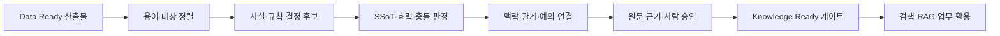

# Knowledge Ready — 의미와 효력을 믿을 수 있게

Knowledge Ready는 문서를 많이 검색하거나 AI가 요약한 상태가 아니다. 데이터 속
사실·규칙·결정이 **무엇을 뜻하고, 어디에 언제 적용되며, 어떤 원천이 권위 있고,
누가 승인·정정하는지** 설명할 수 있는 상태다.

::: tip 완료를 판단하는 한 문장
AI가 답을 만들기 전에 사람도 같은 용어·시점·범위·근거로 같은 결론을 검증할 수 있다.
:::

<figure class="guide-illustration">
  
  <figcaption>AI가 찾은 후보와 사람이 승인한 지식을 분리하고, 미확정 항목은 억지로 답하지 않고 보류한다.</figcaption>
</figure>

## 네 가지 준비축

  

    01 · SEMANTICS
    <strong>용어와 의미</strong>
    
표준명·정의·동의어·금지 표현·단위·코드를 업무 소유자가 합의한다.

  

  

    02 · AUTHORITY
    <strong>권위와 효력</strong>
    
SSoT·승인 상태·효력 기간·적용 범위·대체 관계·충돌 처리 규칙을 둔다.

  

  

    03 · CONTEXT
    <strong>맥락과 관계</strong>
    
사실·규칙·결정·절차와 대상·조건·예외·선후 관계를 연결한다.

  

  

    04 · EVIDENCE
    <strong>근거와 승인</strong>
    
주장별 원문 위치·버전·승인자·검토일과 정정·피드백 절차를 유지한다.

  

표준 용어와 동의어·분류 관계는 [W3C SKOS](https://www.w3.org/TR/skos-reference/),
출처와 생성·변환 책임은 [W3C PROV-O](https://www.w3.org/TR/prov-o/)의 개념을 참고할
수 있다. 모든 지식을 지식그래프로 만들 필요는 없지만 의미와 출처 필드는 명시해야 한다.

## 데이터가 지식이 되는 경계

| Data Ready 산출물 | 더 필요한 판단 | Knowledge Ready 산출물 |
| --- | --- | --- |
| 추출된 절차서 본문 | 현재 어느 공장·설비에 유효한가 | 승인 상태·효력·적용 범위 |
| 정규화된 설비 코드 | 현장어와 표준명이 어떻게 연결되는가 | 용어·동의어·코드 매핑 |
| 중복 문서 후보 | 어느 원천이 어떤 질문의 권위 원천인가 | SSoT·대체·충돌 판정 |
| 메일 스레드와 첨부 | 무엇이 제안이고 최종 결정인가 | 결정·근거·책임·효력 기록 |
| OCR·ASR 텍스트 | 잘못 인식하면 위험한 수치가 무엇인가 | 사람 확인·신뢰도·승인 상태 |

## Knowledge Ready 작업 순서

1. [용어사전](../reference/glossary.md)과 조직의
   [업무 용어사전 템플릿](../templates/glossary-template.md)으로 같은 말을 맞춘다.
2. 문장에서 사실·규칙·결정·절차·정의를 구분해 지식 후보를 만든다.
3. [EDM과 SSoT](../04-sources/edm-ssot.md)에 따라 권위·효력·충돌을 사람이 판정한다.
4. 대상·조직·제품·지역·시점·조건·예외와 관련 지식을 연결한다.
5. [지식 단위 설계](knowledge-units.md)에 원문 위치와 승인 상태를 기록한다.
6. 실제 질문과 [RAG 골든셋](../templates/rag-golden-set.md)으로 근거 선택을 검증한다.

## Knowledge Ready 게이트

- [ ] 핵심 용어와 코드의 표준명·동의어·소유자가 있다.
- [ ] 질문 유형별 권위 원천과 SSoT 판정 규칙이 있다.
- [ ] 상태·효력 기간·대상·지역·제품 등 적용 범위를 표현한다.
- [ ] 원천이 충돌하거나 미확정일 때 공개·보류·에스컬레이션한다.
- [ ] 사실·규칙·결정이 정확한 원문 위치와 버전으로 추적된다.
- [ ] AI가 만든 후보와 사람이 승인한 지식을 구분한다.
- [ ] 정정·폐기·재검토와 영향을 받는 질문의 갱신 책임자가 있다.

::: danger SSoT를 모델이 결정하게 하지 않는다
AI는 중복·충돌·최신 후보를 찾을 수 있지만 업무상 효력과 위험을 승인할 권한은 없다.
미확정 지식은 서비스에서 제외하거나 상태를 명확히 보여준다.
:::

두 게이트를 통과했다면 [AI 활용·운영](../ai-use/)에서 청킹·색인·RAG·평가로
연결한다.
