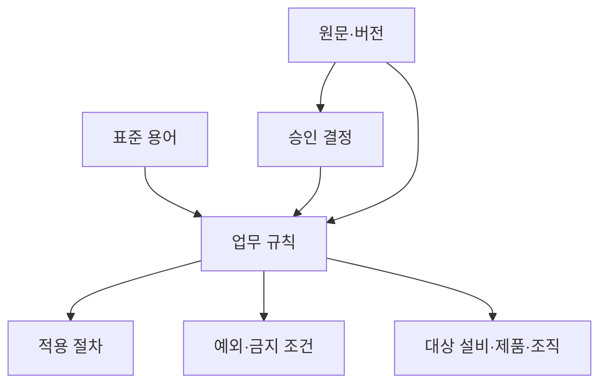

# 지식 단위·관계·효력 설계

문서 한 개를 지식 한 개로 보지 않는다. 한 문서 안에는 정의·사실·규칙·절차·결정·가정과
폐기된 내용이 섞여 있다. 지식 단위는 AI가 만든 요약문이 아니라 **사람이 검증할 수
있는 주장과 그 적용 조건 및 근거를 묶은 관리 단위**다.

## 먼저 다섯 유형을 구분한다

| 유형 | 답하는 질문 | 예시 |
| --- | --- | --- |
| 정의 | 이 말은 무엇을 뜻하는가 | “긴급 정지는 설비 전원을 즉시 차단하는 상태다.” |
| 사실 | 특정 시점에 무엇이 관찰됐는가 | “7월 18일 A설비 압력이 8.2bar였다.” |
| 규칙 | 어떤 조건에서 무엇을 해야 하는가 | “압력이 8bar를 넘으면 밸브 V3를 점검한다.” |
| 절차 | 어떤 순서와 역할로 수행하는가 | “잠금 확인 후 압력 해제, 밸브 점검 순으로 진행한다.” |
| 결정 | 누가 어떤 선택을 왜 승인했는가 | “운영책임자가 8월부터 A양식을 승인했다.” |

유형을 구분하면 사실을 영구 규칙처럼 답하거나, 회의 제안을 승인 결정처럼 답하는 오류를
줄일 수 있다.

## 최소 지식 단위

```yaml
knowledge_id: maintenance:rule:pressure-v3:1
type: rule
statement: 압력이 8bar를 초과하면 밸브 V3를 점검한다.
subject: A공장 식각 설비
conditions: [운전 중, 경보 코드 P-08]
exceptions: [정기 정비 모드]
effective_from: 2026-08-01
effective_to: null
status: approved
owner: 설비기술팀장
approved_by: 운영책임자
source_refs:
  - source_id: edm:OPS-MNT-014:2.1
    location: 4.2절
supersedes: maintenance:rule:pressure-v3:0
acl_groups: [maintenance-engineers]
review_due: 2027-02-01
```

필드를 많이 만드는 것이 목적이 아니다. 질문에 답할 때 필요한 **문장·대상·조건·효력·
상태·소유자·근거·권한**이 빠지지 않는 것이 목적이다. 일반 자원의 제목·작성자·날짜 같은
필드는 [DCMI Metadata Terms](https://www.dublincore.org/specifications/dublin-core/dcmi-terms/)를
참고하고, 업무 효력과 승인 필드는 조직이 확장한다.

## 관계는 필요한 질문부터 만든다



처음부터 거대한 온톨로지를 만들지 않는다. 실제 질문에 필요한 관계부터 시작한다.

- `정의한다`: 용어와 표준 의미
- `적용된다`: 규칙·절차와 대상·지역·제품
- `근거가 된다`: 원문과 사실·규칙·결정
- `승인한다`: 결정과 지식 단위
- `대체한다`: 새 버전과 이전 지식
- `예외다`: 규칙과 적용 제외 조건
- `충돌한다`: 동시에 참일 수 없는 후보

## 문서·메일에서 승인 지식까지

1. 원문과 메타데이터를 보존하고 문장 후보를 추출한다.
2. AI는 정의·사실·규칙·결정 후보와 원문 위치만 제안한다.
3. 현업 검토자는 문장·유형·대상·조건·예외를 확인한다.
4. 업무 소유자는 상태·효력·권위·충돌·대체 관계를 승인한다.
5. 승인된 버전만 검색 서비스에 게시하고 미확정 후보는 분리한다.
6. 원문 개정 시 영향을 받는 지식·질문·골든셋을 찾아 재검토한다.

### 메일 예시

```text
메일 문장: “그럼 다음 달부터 A양식으로 갑시다. 김대리 반영 부탁.”

AI 후보:
- 유형: 결정 후보
- 선택: A양식
- 효력: 다음 달
- 담당: 김대리
- 빠진 값: 정확한 날짜, 적용 조직, 승인권자, 근거

사람 승인 후:
- 2026-08-01부터 국내 A공장의 정비 요청은 A양식을 사용한다.
- 승인자: 정비팀장 / 근거: 필수 안전 필드 누락 방지
- 원 메일 Message-ID와 첨부 버전을 연결한다.
```

AI가 빈 값을 추측해서 채우지 않고 담당자에게 확인 질문을 돌려주는 것이 Knowledge
Ready의 핵심이다.

## 품질 규칙

- **완전성**: 대상·조건·효력·상태·근거 중 필수값이 있는가?
- **일관성**: 같은 용어·코드·단위와 충돌하지 않는가?
- **권위성**: 승인권자가 허용된 원천으로 승인했는가?
- **추적성**: 정확한 원문·버전·위치로 돌아갈 수 있는가?
- **시의성**: 검토일이 지나거나 대체된 지식이 노출되지 않는가?
- **실행 가능성**: 사용자가 다음 판단이나 행동에 필요한 조건을 이해하는가?

## 하지 말아야 할 것

- LLM 요약을 원문 검토 없이 승인 지식으로 저장
- 문서 수정일만으로 현재 유효한 규칙을 결정
- 서로 다른 부서의 같은 약어를 하나의 뜻으로 강제 병합
- 예외와 적용 범위를 버리고 짧은 문장만 벡터DB에 저장
- 원문 ACL보다 넓은 사용자에게 지식 단위를 공개
- 사람이 고친 결과를 원천·용어사전·평가셋에 되돌리지 않음

지식 단위가 준비되면 [권한 인식 RAG](../05-pipeline/rag-operations.md)에서 검색·인용·
거절을 평가하고, 운영 중 발견된 오류를 이 승인 흐름으로 되돌린다.
