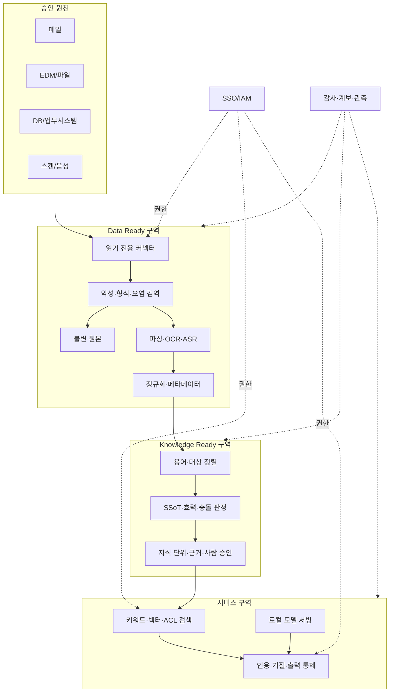

# 온프레미스 참조 아키텍처

제품 목록이 아니라 필요한 **역량, 신뢰경계, 운영 책임**을 먼저 정한다. 예시 도구는
조직의 보안·라이선스·성능 검토를 통과한 경우에만 사용한다.

## 공통 논리 구조

## 프로필 A — 단일 서버형

**적합:** 한 팀, 승인 원천 한두 개, 사용자 5~20명, 90일 읽기 전용 파일럿.

| 영역 | 최소 역량 | 구현 예시 |
| --- | --- | --- |
| 저장 | 암호화 볼륨, 원본/파생 분리, 일별 백업 | 조직 표준 파일/오브젝트 저장소 |
| 파싱 | Office/PDF/메일, OCR, ASR를 배치 실행 | [Apache Tika](https://tika.apache.org/), [Tesseract](https://github.com/tesseract-ocr/tesseract), [Whisper](https://github.com/openai/whisper) 계열 |
| 검색 | 키워드+벡터+메타데이터/ACL 필터 | PostgreSQL FTS + [pgvector](https://github.com/pgvector/pgvector) 등 |
| 모델 | 승인된 단일 GPU/CPU의 로컬 추론 | [vLLM](https://docs.vllm.ai/) 또는 조직 승인 런타임 |
| 접근 | 사내 SSO 그룹과 애플리케이션 역할 매핑 | 기존 IAM/리버스 프록시 |
| 운영 | 구조화 로그, 버전 manifest, 수동 승인 게이트 | 파일럿 전용 대시보드·티켓 |

**주요 실패:** 한 호스트에 원본·검색·모델·로그가 모여 장애와 관리자 과권한의 영향이
크다. 사용자·원천·중요도가 늘면 프로필 B로 이동한다.

## 프로필 B — 부서 공용형

**적합:** 여러 원천과 팀, 사용자 수십~수백 명, 매일 증분 수집과 운영 SLO가 필요.

| 영역 | 추가 역량 |
| --- | --- |
| 구역·네트워크 | 수집/검역, 정제, 검색/모델, 관리 구역 분리와 기본 deny |
| 처리 | 작업 큐, 형식별 파서 worker, 재시도·격리 대기열, 멱등 증분 처리 |
| 저장·검색 | 버전·보존 가능한 오브젝트 저장, 복제 DB, 권한 필터 검색엔진 |
| IAM | 중앙 SSO, 그룹 동기화, 서비스 계정/비밀 분리, 운영자 JIT 권한 |
| 관측 | 파이프라인·검색·모델·ACL·삭제 SLO와 SIEM 연동 |
| 배포 | 내부 패키지/컨테이너/모델 저장소, 서명 검증, 단계적 승격·롤백 |

[OpenSearch 벡터 검색](https://docs.opensearch.org/latest/vector-search/) 같은 검색엔진을
예시로 검토할 수 있지만, 제품의 기능 존재가 원본 ACL 모델과 정확히 맞는다는 뜻은
아니다. 문서·청크별 필터 성능과 권한 회수 시간을 실제 데이터로 시험한다.

**주요 실패:** 중앙 색인을 만들며 부서별 ACL과 보존 규칙을 평탄화하거나, 큐 적체와
삭제 실패가 조용히 쌓일 수 있다.

## 프로필 C — 전사 고가용성형

**적합:** 규제·다부서·핵심 업무, 수천 사용자, 보안영역별 격리, DR과 상시 평가 필요.

- 원천·정보등급별 보안영역과 교차영역 전송 승인
- HA 저장·검색·모델 클러스터, 용량 격리, 재해복구 목표와 복구 훈련
- 전사 카탈로그·계보와 정책 엔진, 속성 기반 접근통제(ABAC)
- HSM/중앙 키관리, 운영자 세션 통제, 대량 열람·내보내기 탐지
- 모델·데이터·프롬프트·정책별 릴리스 레지스트리와 자동 회귀 평가
- 데이터 오염·권한 누출·삭제 실패 전용 사고대응과 영향 질의 추적
- 법적 보존, 백업 삭제, 국외·외부 반출, 공급망을 포함한 감사 증거

**주요 실패:** 플랫폼 표준화가 현업 SSoT·용어·품질 책임을 대신한다고 오해하거나,
복잡한 인프라를 첫 유즈케이스 이전에 구축해 가치 검증이 늦어진다.

## 선택 표

| 질문 | A | B | C |
| --- | --- | --- | --- |
| 원천/부서 | 1~2 / 한 팀 | 여러 개 / 한두 부서 | 다수 / 전사·보안영역 |
| 사용자 | 5~20 | 수십~수백 | 수백~수천+ |
| 갱신 | 수동·일 배치 | 증분·일/시간 | 준실시간·다중 SLA |
| 가용성 | 업무 외 파일럿 | 부서 운영 | 핵심업무 HA/DR |
| 권한 | 그룹 RBAC | 문서 ACL+중앙 IAM | ABAC·영역 분리·JIT |
| 운영 | 소수 담당자 | 온콜·SIEM·SLO | 전담 플랫폼·보안·감사 |

규모 수치는 구매 기준이 아닌 논의를 위한 기본값이다. 데이터 등급이 높거나 오류 비용이
크면 사용자 수가 적어도 더 강한 통제가 필요하다.

## 제품 검토 질문

- 완전 오프라인 설치·업데이트·라이선스 확인이 가능한가?
- 원격 측정과 자동 외부 연결을 목록화하고 끌 수 있는가?
- 문서·청크 수준 ACL, 권한 회수, 삭제 증거를 제공하는가?
- 데이터·모델·설정 이식과 롤백이 가능한가?
- 감사로그에 사용자, 검색 필터, 원천·청크, 정책 버전이 남는가?
- 구성요소의 라이선스, SBOM, 서명, 취약점 대응 절차가 있는가?
- 조직 표준 백업·DR·키관리·SIEM과 통합되는가?

아키텍처 선택 후 [온프레미스 보안](../02-govern/security.md)의 공격 시나리오와
[RAG 골든셋](../templates/rag-golden-set.md)을 통과시킨다.
